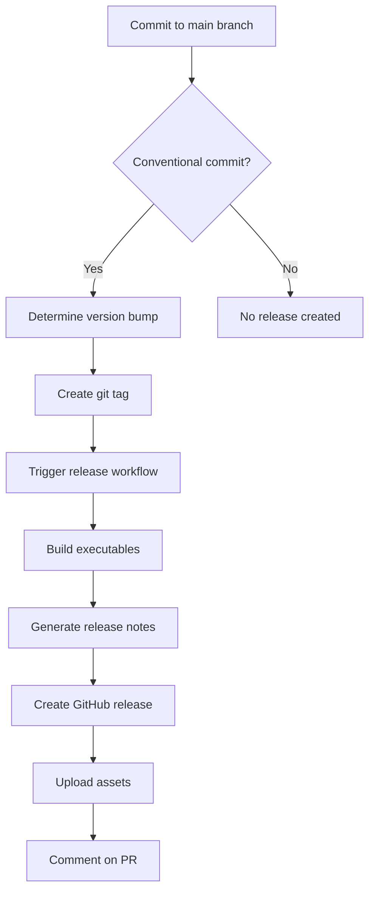

# 🚀 Automatic Release Guide

This guide explains how the automatic release system works for Baresha Downloader.

## 📋 Overview

The project uses GitHub Actions to automatically create releases based on:
1. **Conventional Commit Messages** - Automatic releases triggered by commit patterns
2. **Manual Tag Pushes** - Traditional releases triggered by git tags
3. **Scheduled Checks** - Weekly reminders and health checks

## 🔄 Release Workflows

### 1. Auto Release (`auto-release.yml`)

**Triggers:**
- Push to `main` or `master` branch
- Pull request merge

**How it works:**
1. Analyzes commit messages for conventional commit format
2. Determines version bump type (major/minor/patch)
3. Creates and pushes git tags automatically
4. Generates release notes from commits
5. Creates GitHub release with assets

**Conventional Commit Format:**
```
<type>(<scope>): <description>

[optional body]

[optional footer(s)]
```

**Types that trigger releases:**
- `feat:` - New feature (minor version bump)
- `fix:` - Bug fix (patch version bump)
- `BREAKING CHANGE:` - Breaking change (major version bump)
- `revert:` - Revert previous commit (patch version bump)

**Examples:**
```bash
# Minor version bump (1.0.0 → 1.1.0)
git commit -m "feat: add playlist download support"

# Patch version bump (1.0.0 → 1.0.1)
git commit -m "fix: resolve download resume issue"

# Major version bump (1.0.0 → 2.0.0)
git commit -m "feat: completely redesign UI

BREAKING CHANGE: API has changed significantly"
```

### 2. Manual Release (`release.yml`)

**Triggers:**
- Push of tags matching `v*` pattern

**How it works:**
1. Builds executables for Windows, macOS, and Linux
2. Generates comprehensive release notes from CHANGELOG.md
3. Creates GitHub release with all platform assets
4. Includes detailed installation instructions

**Usage:**
```bash
# Create and push a tag
git tag -a v1.1.0 -m "Release v1.1.0"
git push origin v1.1.0
```

### 3. Continuous Integration (`ci.yml`)

**Triggers:**
- Push to main/master/develop branches
- Pull requests

**Features:**
- Runs tests on multiple Python versions
- Code linting and formatting checks
- Security vulnerability scanning
- Build testing across platforms
- Documentation validation

### 4. Scheduled Tasks (`scheduled.yml`)

**Triggers:**
- Every Monday at 9 AM UTC
- Manual workflow dispatch

**Features:**
- Weekly dependency update checks
- Security vulnerability scanning
- Release reminders for unreleased changes
- Repository health monitoring

## 🎯 Release Types

### Automatic Releases

**Minor Release (1.0.0 → 1.1.0):**
```bash
git commit -m "feat: add new download format support"
git push origin main
```

**Patch Release (1.0.0 → 1.0.1):**
```bash
git commit -m "fix: resolve memory leak in batch downloads"
git push origin main
```

**Major Release (1.0.0 → 2.0.0):**
```bash
git commit -m "feat: redesign entire application architecture

BREAKING CHANGE: All configuration files have new format"
git push origin main
```

### Manual Releases

**Standard Release:**
```bash
# Update CHANGELOG.md with new version
# Commit changes
git add CHANGELOG.md
git commit -m "docs: update changelog for v1.1.0"

# Create and push tag
git tag -a v1.1.0 -m "Release v1.1.0"
git push origin v1.1.0
```

## 📝 Release Notes Generation

### Automatic Release Notes

The system generates release notes by:
1. **Extracting commits** since the last tag
2. **Categorizing changes** by commit type
3. **Including installation instructions** for all platforms
4. **Adding feature highlights** and system requirements

### Manual Release Notes

For manual releases, the system:
1. **Reads CHANGELOG.md** for the specific version
2. **Combines with commit history** since last tag
3. **Creates comprehensive notes** with installation guides
4. **Includes platform-specific instructions**

## 🔧 Configuration

### Project Configuration (`pyproject.toml`)

The project uses semantic versioning configuration:
- **Version tracking** in multiple files
- **Conventional commit parsing**
- **Changelog generation**
- **Build automation**

### GitHub Actions Configuration

**Required Secrets:**
- `GITHUB_TOKEN` - Automatically provided by GitHub

**Optional Secrets:**
- `PYPI_TOKEN` - For PyPI publishing (if enabled)
- `CODECOV_TOKEN` - For code coverage reporting

## 📊 Release Process Flow



## 🛠️ Troubleshooting

### Common Issues

**1. Release not created:**
- Check commit message format
- Verify branch is `main` or `master`
- Check GitHub Actions logs

**2. Build failures:**
- Check Python version compatibility
- Verify all dependencies are available
- Check for platform-specific issues

**3. Missing assets:**
- Ensure build process completed successfully
- Check artifact upload permissions
- Verify file paths in workflow

### Debugging

**Check workflow status:**
1. Go to GitHub repository
2. Click "Actions" tab
3. Select the workflow that failed
4. Review logs for specific errors

**Manual trigger:**
```bash
# Trigger manual release
git tag -a v1.1.0 -m "Release v1.1.0"
git push origin v1.1.0
```

## 📚 Best Practices

### Commit Messages

**Good examples:**
```bash
feat: add support for 4K video downloads
fix: resolve memory leak in batch processing
docs: update installation instructions
refactor: improve error handling in download engine
```

**Bad examples:**
```bash
updated stuff
fixed bug
new feature
```

### Version Management

**Follow semantic versioning:**
- **MAJOR** - Breaking changes
- **MINOR** - New features (backward compatible)
- **PATCH** - Bug fixes (backward compatible)

**Update CHANGELOG.md:**
- Add entries under `[Unreleased]` section
- Use proper categories (Added, Changed, Fixed, etc.)
- Include issue numbers when applicable

### Release Checklist

Before creating a release:
1. ✅ Update CHANGELOG.md
2. ✅ Test on all platforms
3. ✅ Update version in `pyproject.toml`
4. ✅ Verify all tests pass
5. ✅ Check for security vulnerabilities
6. ✅ Review documentation

## 🔗 Related Files

- `.github/workflows/auto-release.yml` - Automatic release workflow
- `.github/workflows/release.yml` - Manual release workflow
- `.github/workflows/ci.yml` - Continuous integration
- `.github/workflows/scheduled.yml` - Scheduled tasks
- `pyproject.toml` - Project configuration
- `CHANGELOG.md` - Release history
- `README.md` - Project documentation

## 📞 Support

For issues with the release system:
1. Check GitHub Actions logs
2. Review this documentation
3. Create an issue with detailed information
4. Contact the maintainers

---

**Made with ❤️ by the Baresha Team** 